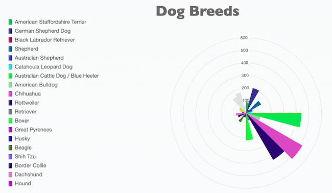
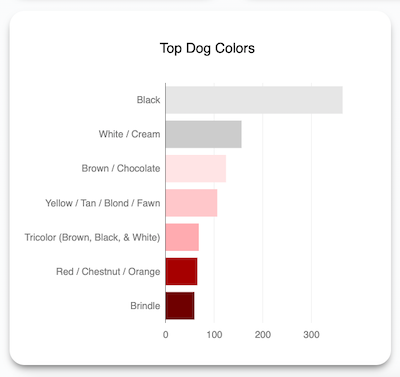
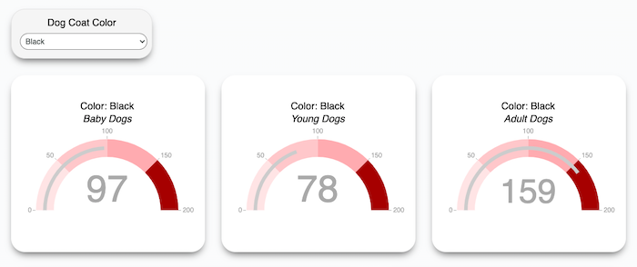
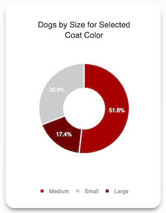
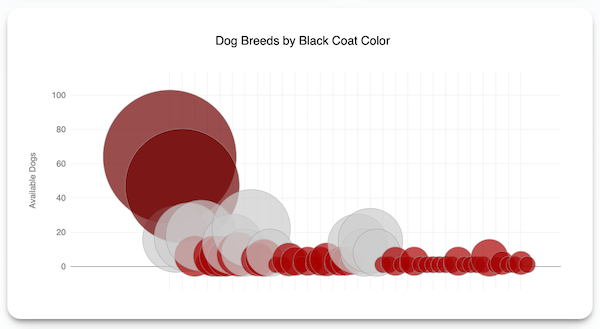
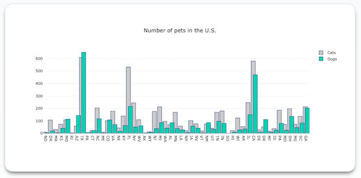
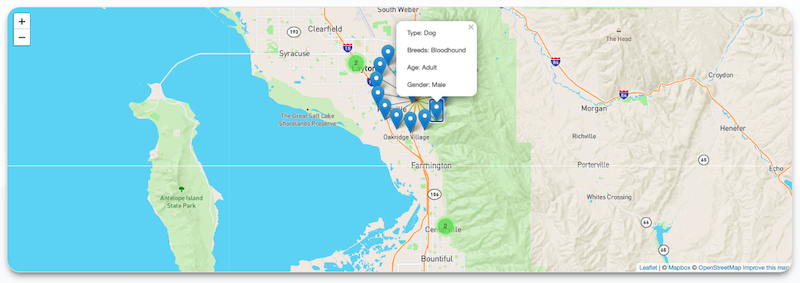
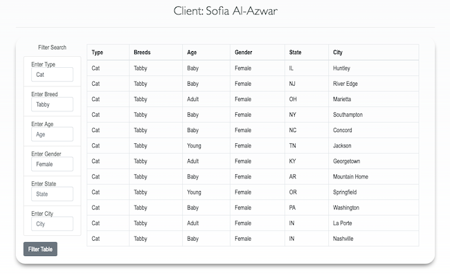

# Wicked Tailor

## The Story
> At our agency, Doggie Data, Inc., we help our clients to identify a right type, to find, and to adapt an ideal pet or pets. We are specializing in determining which type of a pet and which breed is the most suitable for our client and his/her lifestyle. Then, we build a custom dashboard to help our client to analyze available dogs and cats for adaption and to find a perfect match.
>
>Not a long time ago, our agency began working on a project for our new client, Cruella de Vil, who happened to be an owner of an exclusive tailor shop. Ms. Cruella de Vil requested a dashboard with information regarding the number of available dogs and cats for adaption in each state in U.S., a table which can be used to filter pets by pet type, breed, age, gender, state, and city, and a graph with the most common coat colors for dogs and cats.
>
>In addition, Ms. de Vil asked to have the following interactive visualizations on her dashboard:
>+ available dogs and cats by breed
>+ available dogs and cats by age and filtered by most common coat colors 
>+ percentage of available dogs and cats by size and filtered by most common coat colors
>+ available dog and cat breeds for each common coat color
>
>While we were finishing up Ms. de Vil’s dashboard, we were getting more and more suspicious about our client and her intentions. She was not interested in senior pets, she wanted to know total numbers of available cats and dogs in each state and for each breed, she was way too much concerned about pet coat colors, and she was not interested in a perfect match.
>
>Out of curiosity, we did our research about Ms. de Vil and her tailor shop. Based on the results of our findings and Ms. de Vil’s history, the intentions of our client became clear to us, and we refused to provide Ms. de Vil with a custom dashboard, which has been created for her. Instead, we contacted the appropriate agency and Ms. Cruella de Vil has been detained and arrested for an animal cruelty conspiracy, while our dashboard became a part of an evidence portfolio in a case against Cruella de Vil.
>
>#### View the app [here](https://unc-project-2.herokuapp.com/).

## The App

Below are tools and recourses we use to create custom dashboards, which help our clients to find pets they are looking for.

### Data

Pets data has been collected using RESTful API calls from the Petfinder API allowing us to access database of thousands of pets available for adaption in the U.S.

### Tools

The following tools have been utilized to create the app:

+ Backend:
  - *Jupyter Notebook*
  - *Python*
  - *PostgreSQL*
  - *Flask-SQLAlchemy* 
  - *Marshmallow*
  
+ Frontend:
  - *JavaScript*
  - *Bootstrap*
  - *HTML*
  - *CSS*
  - *Plotly*
  - *Leaflet*
  - *Chartjs*
  
+ Hosting:
  - *Heroku*

### Visualizations

Visiting our app you will find dashboards of our other current clients who are actively searching for pets to adapt. Below is a description of each visualization on each client page with a respective image.

- *Cruella de Vil Page*

Polar charts demonstrate a total amount of available dogs/cats by breed. These charts are interactive. Clicking on each breed will take it out of consideration and change the     whole chart to demonstrate a new proportional relationship between breeds.

Bar chart demonstrates the total amount of available dogs/cats by the most common coat colors and the rest of visualizations on the Cruella’s page are filtered by these common    colors.

Gauges show how many baby, young, and adult dogs/cats are available for a selected coat color. Selecting a different coat color from a dropdown menu will show new results for each age category filtered by a selected color.

Donut chart demonstrates percentage of small, medium, and large dogs/cats filtered by a coat colar. Hovering over each part of a donut will show the size of a dog/cat, the number of available pets of this size, and the coat color.

The bubble chart represents a total amount of dogs/cats for a specific coat color by breed. Navigating a mouse cursor in the center of a bubble will display the name of the breed and the number of available dogs/cats for this breed.

- *Dorothy Gale Page*

Bar chart shows total amount of dogs and cats available for adaption in each state. Hover over each bar set to see exact number of available pets for each type.

The interactive map shows locations of pet shelters/animal welfare organizations and available dogs/cats with a detailed information for each. Zoom in or zoom out to find shelters in the specific location(s) and then click on the shelter to visualize its available pets and their description. 

- *Sofia Al-Azwar Page*

Interactive table can be used to filter data by pet type, gender, breed, age, state, and city. The table can be filtered by one or multiple categories at once.

### Our Team 

- Jessica Allred
- Cheryl Fawn Hornung
- Oleksandra Ianchevska
- Zina Zachmann
